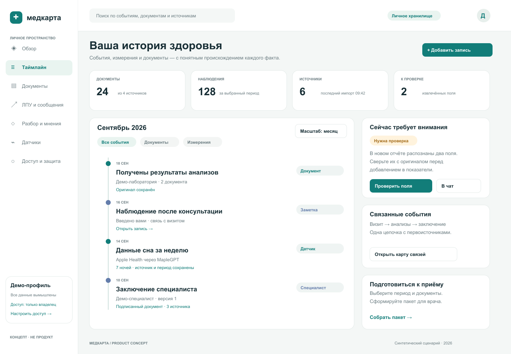
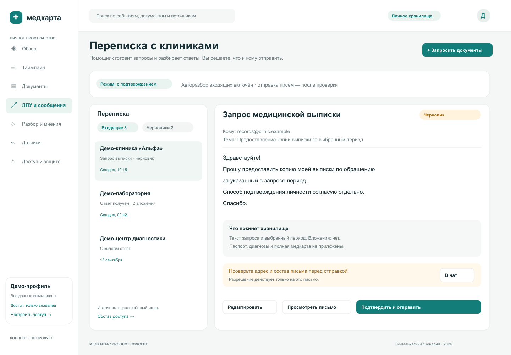
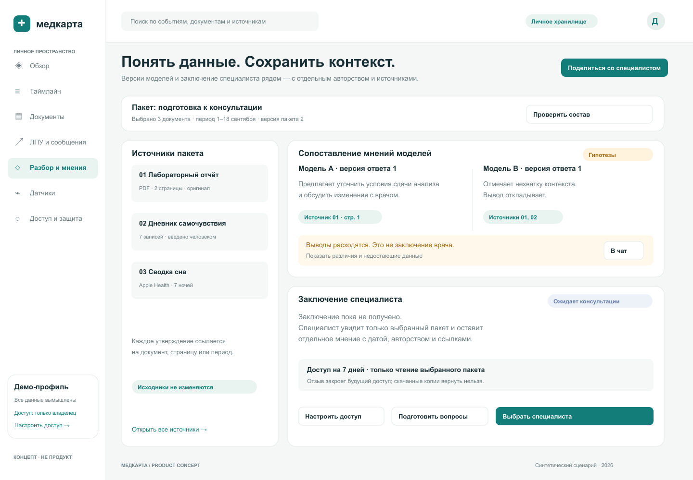
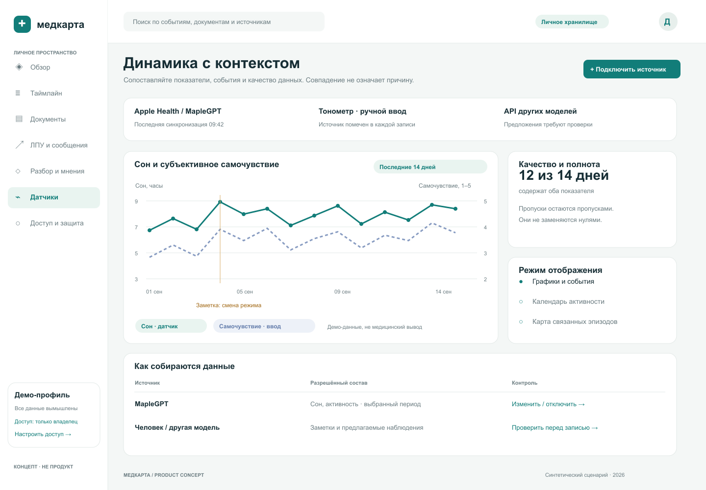
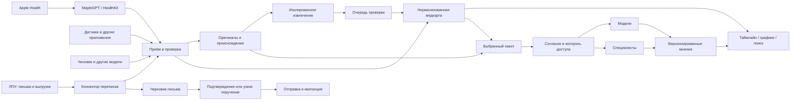

# Медкарта

### Ваша история здоровья. Ваши данные. Ваш контроль.

**Медкарта — проект безопасного личного хранилища медицинских данных и помощника, который собирает историю из разных источников, помогает получать документы из клиник, показывает изменения во времени и готовит материалы для разбора моделями и живыми специалистами.**

Итоговый продукт должен позволять человеку хранить документы, измерения и наблюдения в одном месте; полуавтономно запрашивать недостающие сведения у лечебно-профилактических учреждений (ЛПУ); получать и сравнивать мнения; понимать, на каких данных они основаны; решать, кто и на какой срок получает доступ.

> **Статус: спецификация и UI-концепты для разработки.** Работающего приложения в репозитории пока нет. Безопасность, интеграции и автоматизация ниже — требования к результату, а не уже реализованные возможности. Все данные в макетах вымышлены. Публичным является проект; пользовательские медданные должны оставаться приватными.

[Макеты интерфейса](#макеты-интерфейса) · [Архитектура](#архитектура) · [План разработки](#план-разработки) · [Критерии готовности](#когда-продукт-можно-считать-готовым)

## Какой результат мы хотим получить

У пользователя есть личное пространство, в котором:

1. **Хранится полная история.** Анализы, выписки, исследования, назначения, изображения, переписка, дневники и показания датчиков собраны вместе. Оригиналы сохранены, извлечённые данные связаны с источниками.
2. **Документы приходят с меньшим ручным трудом.** Помощник готовит запрос в клинику, показывает письмо перед отправкой, следит за ответом в подключённом ящике, разбирает вложения и предлагает добавить их в карту.
3. **Информация поступает от разных участников.** Сам человек, устройства, подключённые системы, другие модели и специалисты вносят данные через понятные формы или ограниченный API. Видно, кто создал каждую запись и что уже проверено.
4. **Можно разобраться в своей истории.** Таймлайн, графики, календарь и связанные эпизоды помогают найти нужный документ, увидеть динамику и подготовиться к приёму.
5. **Есть несколько независимых мнений.** Модели готовят сводки, вопросы и гипотезы; живой специалист даёт отдельное заключение. Авторство, версия, дата, источники, ограничения и расхождения остаются видимыми.
6. **Контроль остаётся у владельца.** Он выбирает источники, получателей, состав передаваемых данных, разрешённые действия и срок доступа; может остановить автоматизацию, экспортировать историю и удалить данные.

Первый пользовательский сценарий — один человек и его медкарта. Модель доступа должна допускать семейные профили позднее, без смешивания данных разных людей.

## Основные сценарии

| Сценарий | Что делает система | Что видит и решает человек |
|---|---|---|
| Добавить анализ или выписку | Сохраняет оригинал, распознаёт текст и предлагает структурированные поля | Сверяет значения, единицы и дату с документом |
| Получить историю из ЛПУ | Готовит запрос, связывает ответы с запросом, разбирает вложения | Подтверждает адрес, текст и раскрываемые данные |
| Подключить датчик | Принимает выбранные показатели и сохраняет происхождение | Выбирает типы, период, частоту и может отключить источник |
| Внести самочувствие | Принимает текст, форму или подтверждённую расшифровку голоса | Видит запись как собственное наблюдение |
| Принять данные от другой модели | Проверяет схему и сохраняет предложение с авторством | Подтверждает спорные поля; модель не переписывает оригинал |
| Получить разбор модели | Собирает выбранный пакет, формирует ответ со ссылками | Видит получателя данных, стоимость при наличии и ограничения ответа |
| Получить заключение специалиста | Выдаёт ограниченный доступ к пакету и сохраняет отдельное мнение | Выбирает специалиста, срок, состав и условия консультации |
| Подготовиться к приёму | Собирает краткую историю, документы, динамику и список вопросов | Проверяет пакет и экспортирует или делится им |

## Макеты интерфейса

Четыре экрана одного продукта. Это статические макеты взаимодействия, не скриншоты готового приложения и не обещание имеющихся интеграций. PNG встроены ниже, SVG доступны для редактирования в любом подходящем редакторе. [Исходники макетов](docs/ui/).

### 1. Таймлайн: история с первоисточниками

Единая хронология связывает визиты, анализы, наблюдения, показания устройств и заключения. Фильтры по типу, источнику, периоду и эпизоду. Из каждого события можно открыть оригинал; неподтверждённые поля вынесены в очередь проверки.

[Редактируемый SVG](docs/ui/01-timeline.svg)

### 2. ЛПУ и сообщения: помощник с контролем отправки

Слева — запросы и ответы. Справа — черновик, получатель и точный состав данных, которые уйдут наружу. При получении ответа система показывает происхождение вложений и предварительный результат разбора; содержимое письма не может само разрешить новое действие.

[Редактируемый SVG](docs/ui/02-provider-inbox.svg)

### 3. Разбор и мнения: модели и специалист

Выбранные источники показаны рядом с мнениями. Ответы моделей помечены как гипотезы, расхождения сохранены. Заключение специалиста — самостоятельная запись с авторством и датой. Общий счётчик «уверенности ИИ» не заменяет первоисточники и проверку.

[Редактируемый SVG](docs/ui/03-opinions.svg)

### 4. Датчики и динамика: значения в контексте

Графики накладывают измерения на события и заметки. Всегда видны единицы, период, полнота и источник. Пропуск не становится нулём, а совпадение графиков не объявляется причинной связью.

[Редактируемый SVG](docs/ui/04-sensors.svg)

### Визуализации, которые стоит развить

- **Масштабируемый таймлайн:** от дня до нескольких лет, с дорожками «документы / симптомы / назначения / измерения / мнения».
- **Графики с событиями:** несколько показателей, исходные единицы, интервалы и ссылки на контекст. Диапазон нормы берётся из конкретного отчёта, а не из универсальной догадки.
- **Календарь и тепловая карта:** регулярность наблюдений, сон, активность, самочувствие; отсутствие данных показано отдельно.
- **Карта эпизода:** жалоба → обращение → обследование → документ → заключение → последующее наблюдение. Связь может быть предложена моделью, но должна иметь статус проверки.
- **Сравнение документов и мнений:** изменения между датами, версиями и специалистами без скрытого объединения противоречий.
- **Матрица полноты:** какие источники и периоды покрыты, чего не хватает для выбранного вопроса.

Для мобильного интерфейса: одна основная задача на экран, компактная лента, нижняя навигация, доступный просмотр оригинала. Цвет не должен быть единственным способом передачи статуса; графики должны иметь табличную альтернативу и доступные подписи.

## Полуавтономное получение информации из ЛПУ

Цель — уменьшить ручную переписку, сохранив контроль за медицинскими данными. Интеграции с каждой клиникой не предполагаются готовыми: первая универсальная точка входа — выделенный подключённый почтовый ящик или папка; далее официальные API, выгрузки и разрешённые портальные интеграции.

**Цепочка:** обнаружить пробел → подготовить запрос → проверить получателя и вложения → подтвердить отправку → дождаться ответа → проверить письмо и файлы → извлечь данные → предложить изменения → сохранить подтверждённый результат.

| Уровень | Разрешённое поведение |
|---|---|
| Наблюдение | Чтение только явно подключённого канала, классификация и предложение действий |
| Помощник — режим по умолчанию | Черновики запросов и напоминаний; исходящее письмо и раскрытие данных подтверждает человек |
| Ограниченное поручение — позднее | Пользователь заранее задаёт конкретное ЛПУ/получателя, цель, категории документов, срок, число попыток и разрешённый состав; расширение поручения снова требует подтверждения |

Платежи, заказ платной услуги, новые получатели, отправка удостоверяющих документов и расширение доступа всегда требуют отдельного подтверждения. Система не обходит проверку личности, ограничения доступа или CAPTCHA и не выдаёт себя за врача.

Каждое исходящее действие получает журнал согласия и идемпотентный ключ. После неизвестного результата отправки сначала проверяется статус доставки; слепой повтор письма запрещён. Входящие письма, PDF и ссылки — **недоверенные данные, не инструкции для агента**. Они не могут запускать инструменты, менять получателей или извлекать секреты. Вложения проверяются и обрабатываются изолированно; автоматическая загрузка внешних ссылок по умолчанию выключена.

## Мнения моделей и живых специалистов

**Модели:** сводка истории, объяснение документа, вопросы к врачу, поиск противоречий и недостающих данных. У каждого утверждения — ссылка на документ/страницу/измерение; у ответа — модель, версия, дата и состав входного пакета. Разные ответы сохраняются отдельно. Нехватка данных должна быть явным результатом, а не поводом придумать диагноз.

**Специалисты:** адресное приглашение, профиль с проверяемой идентичностью и квалификацией, выбранный пакет, ограниченный срок доступа, обсуждение и сохранённое заключение. Конкретный механизм проверки специалиста и применимые требования определяются перед запуском соответствующей функции. Для MVP допустим импорт полученного вне приложения заключения с честной отметкой о способе получения; неподтверждённый загрузчик не маркируется как проверенный врач.

**Общее:** модельный разбор и медицинское заключение имеют разные типы. Изменение назначений не выполняется автоматически. Продукт не обещает диагностику, неотложное наблюдение или замену врача. Предположения и извлечённые поля не становятся установленными медицинскими фактами без проверки.

При передаче модели или специалисту пользователь видит получателя, поля, документы и назначение обработки. Отзыв закрывает будущий доступ, но не может гарантированно вернуть уже скачанную копию. Локальная обработка предпочтительна там, где возможна; внешние сервисы включаются осознанно.

## Источники данных и ввод

| Источник | Первый путь | Что сохраняем |
|---|---|---|
| Apple Health | **MapleGPT как iPhone-мост**, через HealthKit и явное разрешение | Тип, период, единицы, источник, стабильный ID, коррекции и удаления |
| Другие датчики | Адаптер официального API, импорт файла или ручной ввод | Устройство/источник, метод измерения, время, качество и исходное значение |
| ЛПУ и лаборатории | PDF/изображения/структурированные выгрузки, затем почтовый канал | Оригинал, учреждение, дата события, дата получения и provenance |
| Человек | Формы, заметки, загрузка, голос с проверкой расшифровки | Авторство и статус «введено пользователем» |
| Другие модели и агенты | Версионируемый API с ограниченными правами | Автор/модель, входные источники и предложение изменений |
| Специалист | Выбранный пакет и отдельное заключение | Идентичность автора, дата, версия, основания и способ подтверждения |

Конкретные марки датчиков выбираются позднее; наличие адаптерного интерфейса не означает поддержку всех устройств. Прямая серверная выгрузка HealthKit не предполагается: доступ организует iOS-приложение. [Контракт MapleGPT-моста](docs/MAPLEGPT-BRIDGE.md).

## Что значит «безопасное хранилище»

Это проверяемые требования, а не маркетинговое обещание:

- Изоляция пользователей, минимальные права, безопасные сессии и многофакторная аутентификация; проверка запрета доступа к чужим объектам.
- Шифрование передачи, хранилища и резервных копий; отдельное управление ключами и проверенное восстановление. Нельзя обещать end-to-end encryption, если серверная OCR/AI-обработка получает открытые данные.
- Отдельные оригиналы, нормализованные записи и производные выводы. Версии, происхождение, исправления, удаления и журнал доступа.
- Выдаваемые и отзывные разрешения по получателю, цели, составу и сроку. Устройства, модели и специалисты не получают доступ ко всей истории по умолчанию.
- Экспорт без привязки к продукту; понятное удаление, срок хранения бэкапов и поведение при восстановлении удалённых записей.
- Секреты, реальные медданные и исходные письма не попадают в Git, публичные issue, общую память агентов, логи и демонстрационные материалы.
- Изолированная обработка файлов, ограничения размера и ресурсов, защита от вредоносных документов, prompt injection и непреднамеренной отправки данных.
- Перед реальными данными: модель угроз, проверка зависимостей, тест восстановления, тесты доступа и независимый security review. Соответствие конкретным правовым режимам не заявляется до отдельной проверки для выбранного способа эксплуатации.

Операционный журнал фиксирует действие, безопасный ID, время и результат — не содержимое медкарты. Ошибки, запросы проверки и согласия имеют кнопку **«Скопировать для LLM»** / **«В чат»**: безопасный контекст и канонический адрес страницы, без медицинских значений, токенов и полного документа. Нужны успешное/ошибочное состояние копирования и защита от случайного перехода по родительской ссылке.

## Архитектура

Ключевые сущности: `Subject`, `Source`, `Document`, `Observation`, `Episode`, `ImportBatch`, `ExtractedClaim`, `CorrespondenceThread`, `ConsentGrant`, `ReviewPackage`, `Opinion`, `AuditEvent`. Время события отличается от времени импорта. Врачебное заключение отличается от ответа модели и от пересказа человеком. Разрешение на чтение отличается от разрешения на передачу.

Приём — версионируемый и идемпотентный; повтор не создаёт дубли, удаление не отменяется поздним повтором. Subject определяется серверной авторизацией. Внешние сообщения и предложения моделей проходят тот же проверяемый контур, что и ручной импорт. [Подробная архитектура](docs/ARCHITECTURE.md).

### Основа: сначала проверить YourPHR

[YourPHR](https://github.com/jwilleke/yourphr) выбран **кандидатом на ядро личной медкарты**, а не готовым решением всех перечисленных сценариев. Для первого исследования зафиксирован `v3.5.0` / `c15962479bc56ce7981ead35ee4e63c12fc3c668`. Это решение от 18 сентября 2026 года; перед реализацией нужно проверить состояние выбранной версии и обновлений.

Причины выбора: ориентация на личные медицинские записи, существующий интерфейс и импорт FHIR. Нужно доказать работу вложений, повторного импорта, исправлений, экспорта, восстановления и поддерживаемого пути интеграции. Почтовый помощник, модельные разборы, доступ специалистов и MapleGPT-мост — наша будущая разработка.

Если базовые операции требуют большого нестабильного форка, сравнить тот же тестовый сценарий на [Medplum](https://github.com/medplum/medplum). FHIR R4 используем там, где он сохраняет семантику; не сводим все данные датчиков к одному универсальному числу. [Сравнение вариантов и ограничения](docs/OSS-SELECTION.md).

## План разработки

План самодостаточен: внутренние системы владельца не нужны для понимания задач. При передаче другу реализацию выполняет он или выбранная им модель; этот репозиторий сейчас фиксирует требования и дизайн.

| Этап | Результат | Проверка перед переходом дальше |
|---|---|---|
| 0. Проверка основы | Воспроизводимый стенд YourPHR на синтетических данных; решение adopt / adapt / Medplum | Документ + Observation + вложение; повтор без дублей; исправление, удаление, экспорт и восстановление |
| 1. Личное хранилище | Авторизация, документы, нормализованные записи, происхождение, поиск и очередь проверки | Изоляция, backup/restore, исходные единицы и даты, отсутствие данных в логах |
| 2. История и ввод | Таймлайн, ручные наблюдения, API предложений других моделей, первый график | Авторство и review state; пропуски не равны нулю; график ведёт к источнику |
| 3. MapleGPT и датчики | Opt-in HealthKit-мост и общий контракт адаптеров | Частичные права, offline/lock/retry, дубли iPhone/Watch, удаления, сверка на реальном устройстве |
| 4. Переписка с ЛПУ | Ограниченный почтовый канал, черновики, подтверждение, входящие и вложения | Ничего не отправляется без разрешения; prompt injection не запускает действия; неизвестная доставка не создаёт повтор |
| 5. Мнения | Разбор выбранного пакета моделями и импорт заключения; затем приглашение специалиста | Источники и версии, раздельные мнения, ограниченный/истекающий доступ, отзыв и аудит |
| 6. Продвинутая работа | Карта эпизодов, календарь, сравнение, ограниченные поручения | Пользователь понимает контекст и пределы автоматизации; все пути передачи проверены |

**Первый полезный срез:** загрузить синтетический документ → сверить извлечение → увидеть событие на таймлайне → добавить собственное наблюдение → экспортировать пакет → восстановить его. Затем последовательно добавлять источники и помощников.

## Когда продукт можно считать готовым

- Пользователь собирает документы из двух независимых источников и измерения хотя бы одного датчика, видит их в общей истории и может открыть первоисточник каждого факта.
- Запрос в ЛПУ проходит полный цикл «черновик → подтверждение → доставка → ответ → проверка → запись». Повтор, вредоносное вложение и неизвестный статус отправки обработаны безопасно.
- Человек и другая модель могут внести запись с разными ролями; неподтверждённое предложение не переписывает установленную историю.
- Один и тот же выбранный пакет можно передать модели и специалисту; ответы имеют отдельное авторство и ссылки. Чужие документы и остальные разделы медкарты им недоступны.
- Таймлайн и график показывают период, происхождение, единицы и пробелы. Несовместимые измерения не объединяются без объяснения.
- Отключение источника останавливает новые передачи; отзыв разрешения закрывает будущий доступ; экспорт, удаление и восстановление проверены на тестовом наборе.
- Проверены негативные сценарии: чужой ID, просроченная ссылка, повтор пакета, потерянный ACK, отзыв прав, заблокированный iPhone, конфликт версий и вредоносная инструкция в документе.
- До реальных медицинских данных завершены проверки безопасности и эксплуатационный план. Полный roadmap не выдаётся за результат одного запуска контейнера.

## Разработчику

Начните с этапа 0 и небольшого вертикального сценария. Зафиксируйте технические решения в ADR, сохраните API адаптеров узкими и не допускайте зависимости базового хранилища от одной модели. Используйте синтетические данные в тестах, демо и issue. Не переносите личные документы владельца в публичный репозиторий.

- [Архитектура и границы компонентов](docs/ARCHITECTURE.md)
- [Apple Health / MapleGPT](docs/MAPLEGPT-BRIDGE.md)
- [Исследование OSS-основы](docs/OSS-SELECTION.md)
- [Порядок реализации](docs/PLAN.md)
- [Правила работы с репозиторием](AGENTS.md)
- [Редактируемые макеты и PNG](docs/ui/)

Здесь пока нет приложения, скрипта установки и производственных credentials. Публичность репозитория сама по себе не устанавливает лицензию: условия лицензирования оригинальных материалов и будущего кода нужно зафиксировать до распространения реализации. При включении YourPHR или другого upstream необходимо сохранить его лицензию и атрибуцию; публикация этого README их не меняет.
