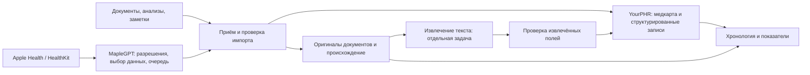

# Медкарта — архитектура для модели-исполнителя

Статус: проектное решение, реализация не начата. Владелец поручил текущей модели только архитектуру и план в Vikunja; исполнение выполняет другая модель.

## Границы компонентов

**MapleGPT** владеет доступом к HealthKit и пользовательским согласием. **Адаптер импорта** владеет аутентификацией устройства, проверкой схемы, привязкой пользователя, повторной доставкой и журналом происхождения. **YourPHR** — выбранный кандидат на хранение/просмотр клинических записей. Отдельное хранилище оригиналов вводить лишь если проверенный механизм вложений YourPHR недостаточен; не создавать второй экземпляр каждого файла без необходимости.

Не считать внутренние таблицы YourPHR публичным API. Первое инженерное решение после исследования — подтвердить официальный импорт либо реализовать небольшой версионируемый адаптер. Если основной продукт требует большого форка для базовых операций, повторить проверку на Medplum.

## Модель данных

- Subject: владелец медкарты. Начальный продукт для одного пользователя; дизайн не должен смешивать записи при дальнейшем добавлении членов семьи.
- Source: источник, внешний идентификатор, способ получения и время импорта.
- ImportBatch: идемпотентный ключ, версия схемы, состояние, счётчики, ссылка на источник; без содержимого медицинских записей в операционной телеметрии.
- Observation: значение, исходная и нормализованная единицы, период, источник, статус проверки. Сохранять диапазон нормы именно из отчёта лаборатории.
- Document: неизменяемый оригинал, контрольная сумма, тип, дата документа и импорта. Исправления создают версию, а не незаметно переписывают источник.
- ExtractedClaim: поле, ссылка на документ/страницу/фрагмент, метод и версия извлечения, уверенность, статус проверки. OCR/LLM-вывод не становится подтверждённым фактом автоматически.
- Deletion/correction: явная операция с происхождением; повторный импорт не должен воскрешать удалённые записи.

FHIR R4 — формат обмена для подходящих клинических сущностей. Для сна, тренировок и непрерывных измерений сначала определить семантику; сохранять исходную структуру, если её нельзя выразить без потери смысла. Порядок отображения использует время события, сохраняя часовой пояс; время поступления учитывается отдельно.

## Контракт приёма — предложение, не существующий API

`POST /v1/import-batches`: ограниченный по размеру пакет с версией схемы и idempotency key. Идентичный повтор возвращает прежнюю квитанцию; другой payload с тем же ключом даёт конфликт. Subject определяется серверной авторизацией. Квитанция выдаётся только после надёжной записи; частичное принятие должно перечислять безопасные идентификаторы результатов и явно определять retry.

`GET /v1/import-batches/{id}`: состояние и безопасные счётчики только для владельца. Нельзя отдавать чужой пакет по угадываемому ID. Реальные маршруты утвердить после проверки YourPHR; не заявлять совместимость заранее.

Состояния: received → validating → accepted / rejected; извлечение документов имеет отдельные pending → processing → needs_review → approved / rejected. Подтверждение транспортной доставки не означает успешное медицинское извлечение.

## Размещение и безопасность данных

Рабочий сервис и долговременные очереди размещаются на согласованном worker/infra-host. M5 — среда активной разработки, не сервер фоновой синхронизации. Перед размещением модель-исполнитель готовит конкретные ресурсы, маршруты, хранение, backup/restore и rollback; регистрация проекта не разрешает full/public/paid расширения.

Требуются приватный HTTPS, контроль доступа владельца, ограниченные и отзывные credentials устройства, шифрование данных и бэкапов, проверенное восстановление. Секреты получать только через project credential route. Не сохранять медицинские записи в Git, общей Qdrant-памяти Obol, Vikunja или логах. Содержание медкарты в LLM передаётся отдельным пользовательским действием с видимым получателем и составом.

## Приёмка продукта

Минимальный вертикальный сценарий: синтетический отчёт + измерения → импорт → отображение происхождения → повтор без дублей → исправление/удаление → экспорт → восстановление. Затем отдельно физический iPhone: явное согласие → выбранный период → приём → сравнение с Apple Health → повтор/обрыв/блокировка устройства без потери и дублей.

Ошибки и запросы проверки в web UI содержат «Скопировать для LLM»: состояние, безопасные IDs, время и canonical URL, без медицинских значений и документа. Кнопка сообщает результат копирования и не активирует родительскую ссылку.

## Передача исполнения

Источники решения: OSS-SELECTION.md, MAPLEGPT-BRIDGE.md, PLAN.md и задачи Vikunja. Исходный MapleGPT checkout содержит незакоммиченные изменения другой работы: не откатывать и не перезаписывать их. Связанный HealthKit predecessor — task 471. Не начинать исполнение автоматически из этой planning-задачи.
